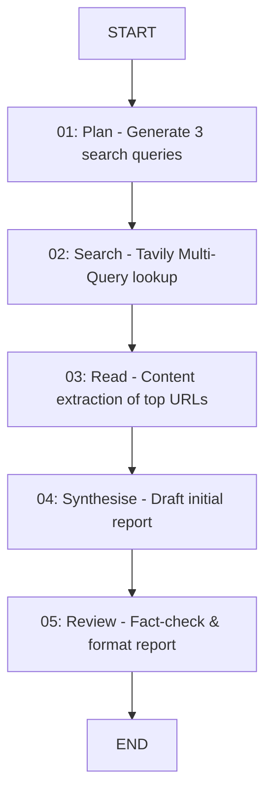

# 🤖 Autonomous Research Agent

An advanced, state-of-the-art autonomous research assistant that generates verified, structured, and comprehensive research reports on any given topic. Powered by a multi-node **LangGraph** orchestrator, **Groq (Llama 3.3 70B)**, and **Tavily Search API**.

Developed by **[Muhammad Yasir](https://github.com/yasirx9)** (Lead AI Developer).

---

## 🌟 Key Features

- **5-Node Agentic Pipeline**: Orchestrated via LangGraph to perform planning, multi-query searching, content extraction, synthesis, and strict fact-checking/review.
- **Dynamic Groq Model List**: Queries the Groq API dynamically on app launch to populate only active text/chat models (filtering out whisper, embedding, and guardrail models).
- **Customizable Search & LLM Parameters**: Configure the agent's depth directly from the sidebar:
  - Select LLM Model (e.g., Llama 3.3, Llama 3.1, Mixtral)
  - Adjust LLM Temperature
  - Set Max Search Results per query
- **Suggested Preset Topics**: One-click quick-start buttons to research pre-configured hot topics.
- **Multi-Tab Results Panel**:
  - **📄 Research Report**: Clean typography rendering the final report.
  - **🔗 Sources & Citations**: Interactive card-deck listing all search matches and source links.
  - **⚙️ Pipeline Metadata**: Displays generated search queries and pipeline parameters used for transparency.
- **Report Exporting**: Download your research report instantly as Markdown (`.md`) or Plain Text (`.txt`).
- **State Persistence**: Built-in session state management so reports remain loaded when downloading files or switching tabs.

---

## 🏗️ Architecture Pipeline

The agent is modeled as a state-based Directed Acyclic Graph (DAG) using **LangGraph**:



---

## 🚀 Quick Start (Local Run)

### 1. Prerequisites
Make sure you have **Python 3.10+** installed. You will also need:
- A **Groq API Key**: Get one from the [Groq Console](https://console.groq.com).
- A **Tavily API Key**: Get one from [Tavily](https://tavily.com).

### 2. Set Up the Project

1. Clone or download this repository.
2. In the project directory, create a `.env` file:
   ```env
   GROQ_API_KEY = "your_groq_api_key_here"
   TAVILY_API_KEY = "your_tavily_api_key_here"
   ```

### 3. Install Dependencies
Run the following command to set up a virtual environment and install the required libraries:

```powershell
# Create a virtual environment
python -m venv venv

# Activate the virtual environment
# On Windows (PowerShell):
venv\Scripts\Activate.ps1
# On macOS/Linux:
source venv/bin/activate

# Install requirements
pip install -r requirements.txt
```

### 4. Run the Streamlit Application
Start the frontend web application:
```bash
streamlit run frontend.py
```
Open your browser at **http://localhost:8501** to begin researching.

---

## ☁️ Deployment Guide (Streamlit Cloud)

1. Push this folder to a new repository on your **GitHub** account.
2. Sign in to [Streamlit Community Cloud](https://share.streamlit.io/).
3. Click **"New App"** and select your repository, branch, and set the Main file path to `frontend.py`.
4. Click **"Advanced settings"** and paste your API keys under **Secrets**:
   ```toml
   GROQ_API_KEY = "your-actual-groq-key"
   TAVILY_API_KEY = "your-actual-tavily-key"
   ```
5. Click **"Deploy!"** and start using your live agent.

---

## 🧑‍💻 Author & Developer

- **Muhammad Yasir** — Lead AI Developer
- **GitHub**: [@yasirx9](https://github.com/yasirx9)
- **LinkedIn**: [Muhammad Yasir](https://www.linkedin.com/in/yasirx9/)

Feel free to connect or open an issue for improvements!
